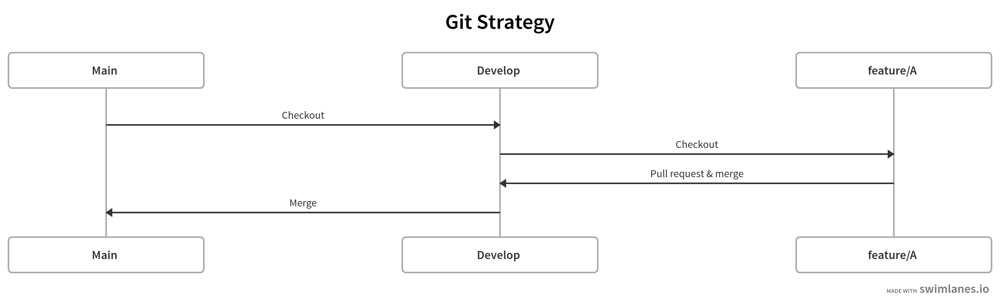

# Notes

To work on this project I implemented below Git Strategy.



To view all commits please click [here](https://github.com/zafar-saleem/airports-filter/commits/main).

To view all branches please click [here](https://github.com/zafar-saleem/airports-filter/branches).

To view all pull request please click [here](https://github.com/zafar-saleem/airports-filter/pulls?q=is%3Apr+is%3Aclosed).

To view Git Strategy please click [here](https://swimlanes.io/u/qkmuwR9iG).

To view screencast please click [here](https://youtu.be/-YIkbSaORaQ).

## Getting Started

The app is designed to work out of the box with no external dependencies, other than node modules.

```shell
yarn install
```


## Running locally

```shell
yarn dev
```

Once started, the app should be available via http://localhost:3000


## Help

For detailed explanation on how things work, check out [Nuxt.js docs](https://nuxtjs.org).
